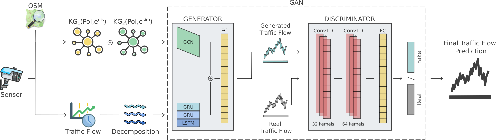

# GRAPHITE - Generative Reasoning and Analysis for Predictive Handling in Traffic Efficiency

## Abstract
Traffic forecasting is a crucial aspect of modern Intelligent Transportation Systems (ITS) and the Internet of Vehicles (IoV), playing a vital role in improving the safety and efficiency of daily transportation activities. Despite the valuable contributions of traditional machine learning (ML) models and advanced deep learning (DL) techniques, there persist challenges in capturing the intricate spatial and temporal dependencies inherent in traffic flow.

In response to these challenges, we present **GRAPHITE**, an innovative framework that combines Graph Neural Networks (GNNs) and Generative Adversarial Networks (GANs) to leverage generative reasoning for efficient traffic management. Our model integrates historical traffic volume data collected by road sensors with local spatial information encoded through knowledge graphs (KGs), capturing relationships between sensors and nearby points of interest (POIs).

Extensive experiments conducted on diverse datasets underscore the efficacy of GRAPHITE. Notably, we achieved a maximum decrease in RMSE of 31.05% compared to GAN-GRU and a maximum increase in R² of 8.15% compared to GAN-RNN, positioning GRAPHITE as a standout solution among current state-of-the-art approaches.

  
*Figure: Architecture of the GRAPHITE framework integrating Graph Neural Networks (GNNs) and Generative Adversarial Networks (GANs) for spatio-temporal traffic forecasting. The generator combines graph-based and recurrent components, while the discriminator evaluates generated sequences against real sensor data.*

📄 **Published in:** *Information Fusion*  
🔗 **DOI:** [10.1016/j.inffus.2024.101065](https://doi.org/10.1016/j.inffus.2024.101065)  

## Citation
If you use this work in your research, please cite:

> Canzaniello, M., Piccialli, F., Longo, A., Izzo, S., & Chiaro, D. (2024). GRAPHITE: Generative Reasoning and Analysis for Predictive Handling in Traffic Efficiency. *Information Fusion*, 101065. https://doi.org/10.1016/j.inffus.2024.101065

## Acknowledgments
- PNRR project FAIR -  Future AI Research (PE00000013), Spoke 3, under the NRRP MUR program funded by the NextGenerationEU.
- G.A.N.D.A.L.F. - Gan Approaches for Non-iiD Aiding Learning in Federations, CUP: E53D23008290006, PNRR - Missione 4 “Istruzione e Ricerca” - Componente C2 Investimento 1.1 “Fondo per il Programma Nazionale di Ricerca e Progetti di Rilevante Interesse Nazionale (PRIN)”.
- PNRR Centro Nazionale HPC, Big Data e Quantum Computing, (CN\_00000013)(CUP: E63C22000980007), under the NRRP MUR program funded by the NextGenerationEU.
